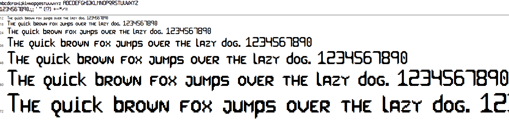
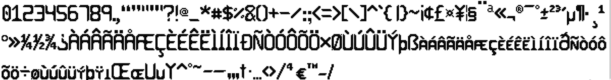
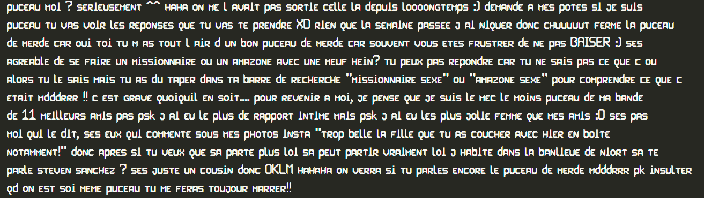
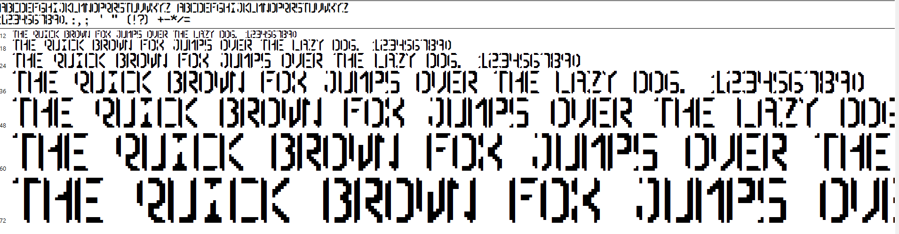

# Sci-Bi

Sci-Bi is a collection of sci-fi inspired pixel fonts I made !

## Sci-Bi Full

- (Almost) Full support of accented characters
- Custom Spacing for each letter, to achieve a compact look
- I recommend that you set the size font at at least 18

Font render inside VSCode at size 25

## Sci-Bi All Caps With Glitches

- All Caps, no lowercase letters.
- Misses a lot (all) of accented characters
- Monospace Spacing
- *Not recommended for anything else than titles*

## Legal

The font files in this archive were created using Fontstruct, the free, online
font-building tool.
Theses fonts were created by Camille Gouneau.

Fontstruct is copyright ©2022 Rob Meek

LEGAL NOTICE:
In using this font you must comply with the licensing terms described in the
file “LICENSE” included with this archive.
If you redistribute the font file in this archive, it must be accompanied by all
the other files from this archive, including this one.
