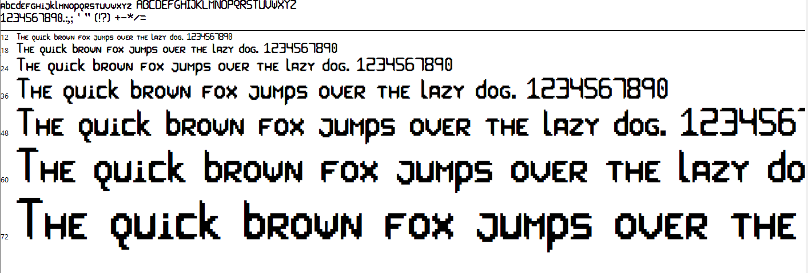

# Sci-Bi

Sci-Bi is a collection of sci-fi inspired pixel fonts I made !

## Sci-Bi

- (Almost) Full support of accented characters
- Custom Spacing for each letter, to achieve a compact look
- I recommend that you set the size font at at least 18

Font rendered inside VSCode at size 25

## Sci-Bi Glitched

- Small Glitched effect on letter and numbers for flair
- Same as Sci-Bi in every aspect otherwise

Font rendered inside VSCode at size 25

## Legal

Theses fonts were created by Camille Gouneau.

LEGAL NOTICE:
In using this font you must comply with the licensing terms described in the
file “LICENSE” included with this archive.
If you redistribute the font file in this archive, it must be accompanied by all
the other files from this archive, including this one.
